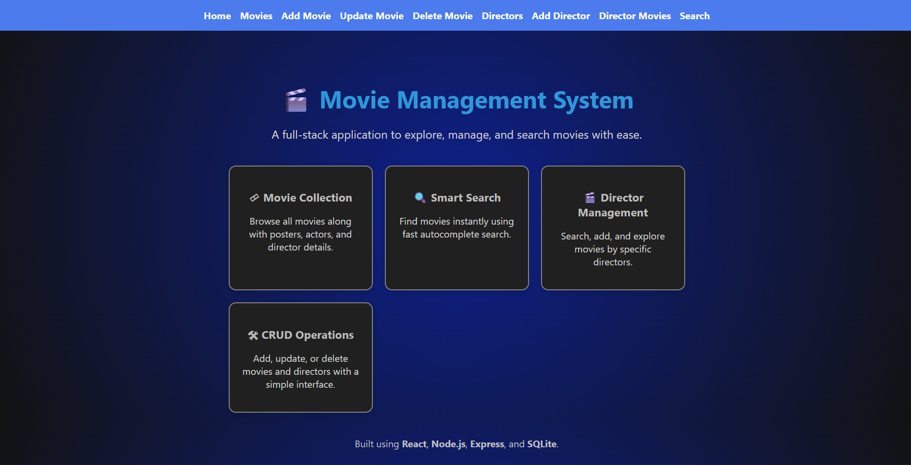
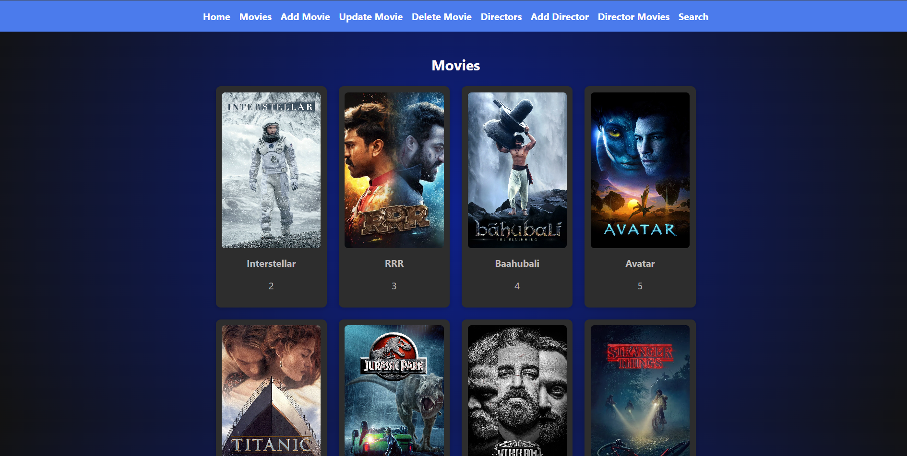
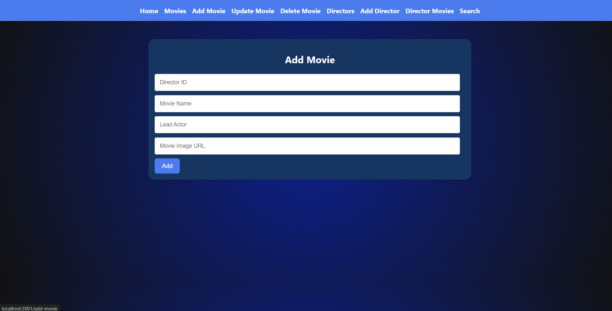
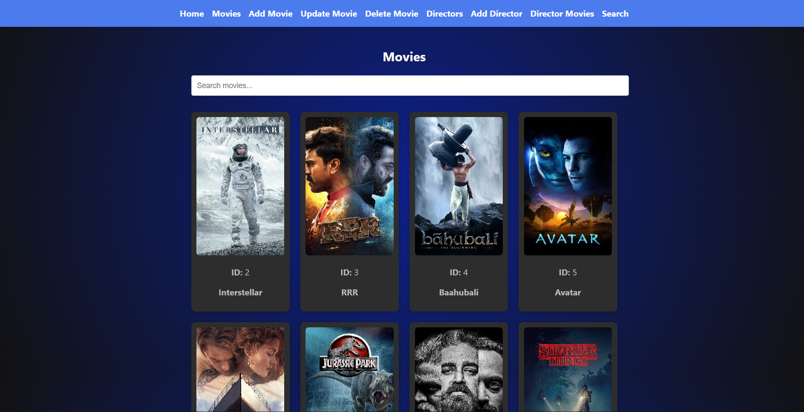

<div align="center">

# 🎬 Movie Management System  
### A full-stack movie database using React, Node.js, Express & SQLite


</div>

---

## 🌙 Overview (Dark UI)

This Movie Management System is a dark-themed full-stack web app that allows users to:

- 🎞️ Browse movies with posters  
- 🎬 Manage directors  
- ✏️ Add / Update / Delete movies  
- 🔍 Search movies & directors (autocomplete)  
- 🎥 View all movies by a director  

It works like a mini-IMDB with a simple and beautiful UI.

---

## ✨ Features

### 🎥 Movie Features  
- Add, update, delete movies  
- View movie ID, poster, and actors  
- Responsive cards layout  
- Movie search `/movies/search/:name`

### 🎬 Director Features  
- Add directors  
- Search directors  
- View movies by director  

### 🔍 Smart Search  
- Autocomplete dropdown  
- Fast filter results  
- Dark-mode UI

---

## 🖼 Screenshots (Add Your Images)

<p align="center">
  
</p>

<p align="center">
  
</p>

<p align="center">
  
</p>

<p align="center">
  
</p>

```md


📂 Project Structure
movie-management-system/
│
├── backend/
│   ├── app.js
│   ├── moviesData.db
│   ├── movies.sql
│   └── package.json
│
├── frontend/
│   ├── src/
│   │   ├── pages/
│   │   │   ├── Home.js
│   │   │   ├── Movies.js
│   │   │   ├── AddMovie.js
│   │   │   ├── UpdateMovie.js
│   │   │   ├── DeleteMovie.js
│   │   │   ├── Directors.js
│   │   │   ├── DirectorMovies.js
│   │   │   ├── SearchMovies.js
│   │   │   └── AddDirector.js
│   │   ├── components/
│   │   │   ├── Navbar.js
│   │   │   └── Navbar.css
│   │   ├── App.js
│   │   ├── App.css
│   │   └── index.js
│   └── package.json
│
└── README.md

| Layer    | Technology              |
| -------- | ----------------------- |
| Frontend | React, CSS (Dark Theme) |
| Backend  | Node.js, Express        |
| Database | SQLite                  |
| Tools    | VS Code, Postman        |


🛠️ Backend Setup
cd backend
npm install

Run SQLite schema
sqlite3 moviesData.db ".read movies.sql"

Start backend server
node app.js


Backend runs at:

http://localhost:3000/

💻 Frontend Setup

In another terminal:

cd frontend
npm install
npm start


Frontend runs at:

http://localhost:3001/


🔗 API Endpoints
🎬 Movies API
Method	       Endpoint	           Description
GET       	/movies/	          Get all movies
GET	       /movies/:movieId/	  Get movie by ID
POST	    /movies/	              Add a movie
PUT	      /movies/:movieId/	     Update a movie
DELETE	  /movies/:movieId/	     Delete a movie
GET	      /movies/search/:name	 Search movies
🎬 Directors API
Method	       Endpoint           	Description
GET	         /directors/      	List all directors
POST	       /directors/         Add a director
GET	     /directors/search/:name	Search director
GET	   /directors/:id/movies/	  Movies by a director

🎯 Target Audience
This application is designed for:

Movie lovers
Film library users
Cinema staff
OTT viewers
Reviewers & bloggers
Students learning web development

Users can browse, search, and view movies easily with posters and clean UI.

🧪 Future Enhancements

User authentication (login/signup)
Movie categories & genres
Ratings and reviews
Pagination & filtering
Admin dashboard
Upload poster instead of URL

🤝 Contributing

Pull requests are welcome.
For major changes, please open an issue first.

📜 License

This project is open-source and free to use.

💬 Author

Sainadh A
Full-Stack Developer
React | Node.js | SQLite
